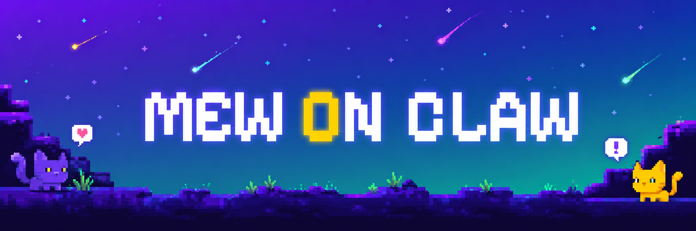
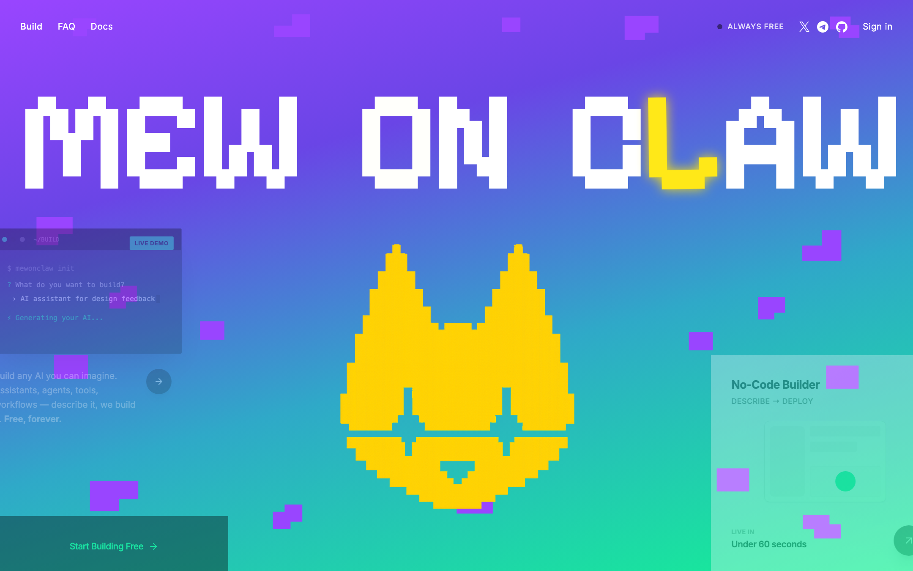
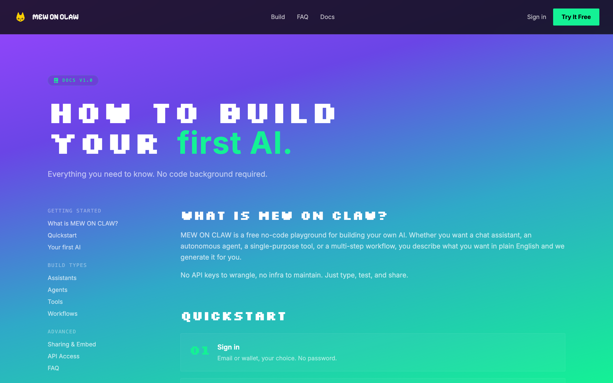
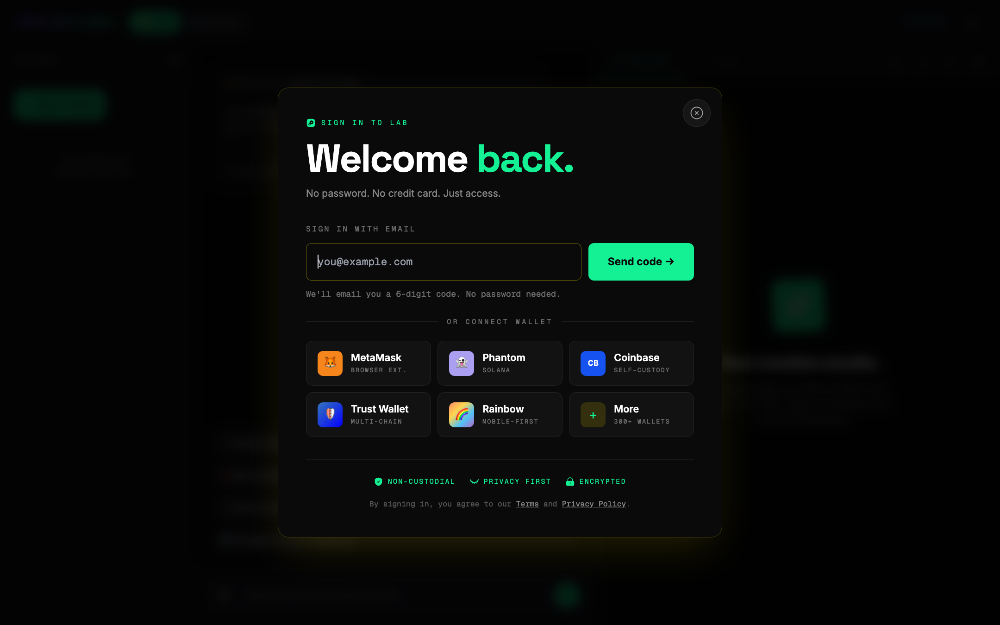
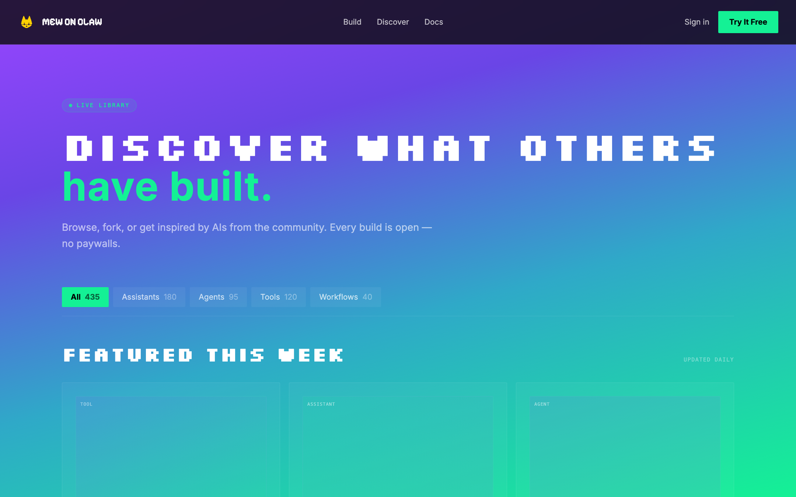
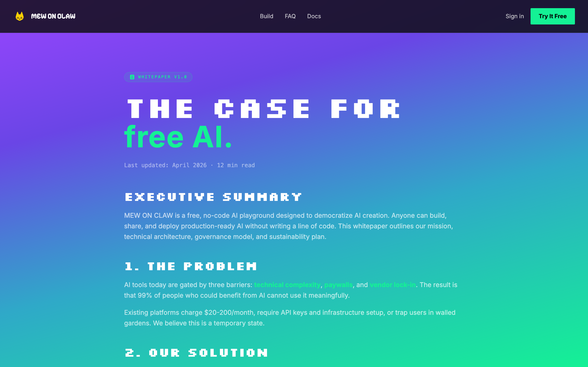
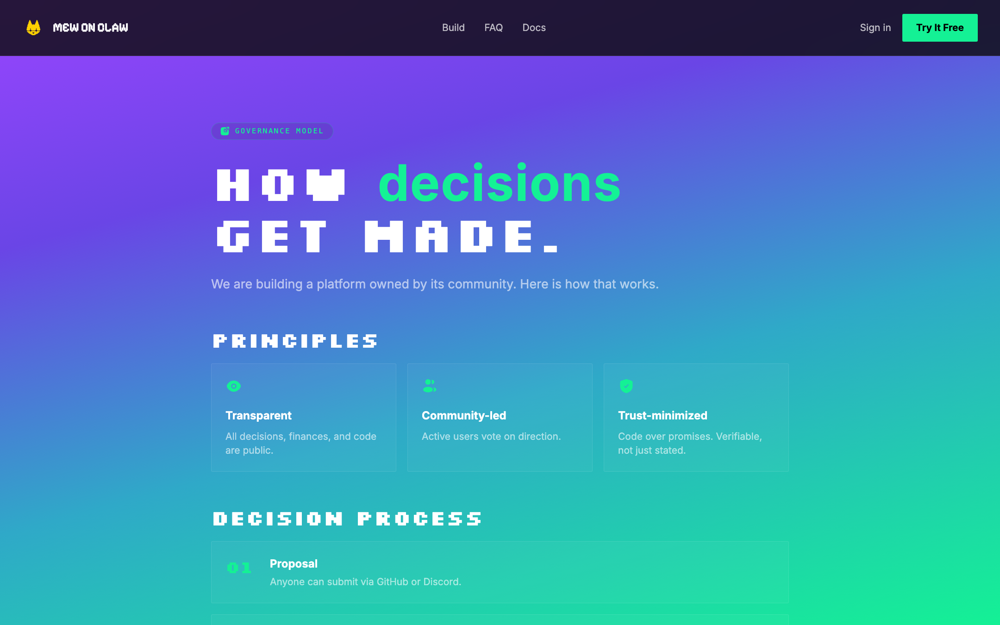
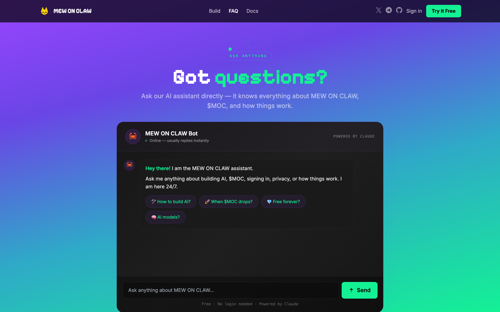
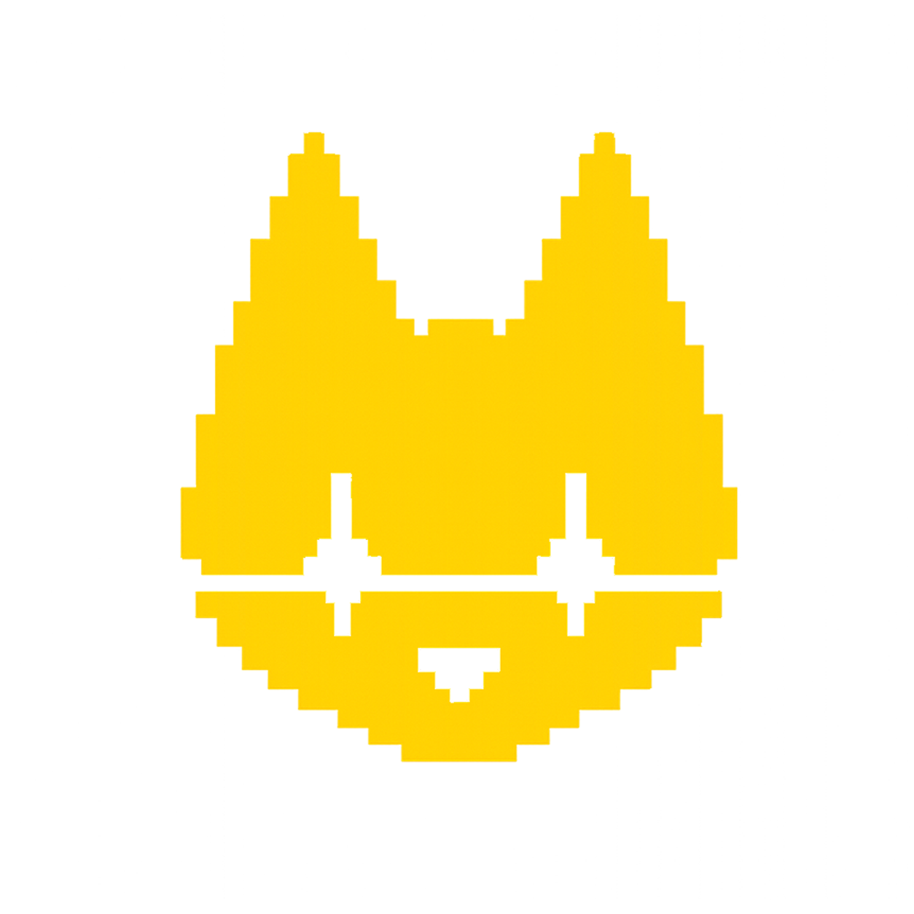

<!-- ╔══════════════════════════════════════════════════════════════╗ -->
<!-- ║                        MEW ON CLAW                           ║ -->
<!-- ╚══════════════════════════════════════════════════════════════╝ -->

<p align="center">
  
</p>

<h1 align="center">🐾 MEW ON CLAW</h1>

<p align="center">
  <b>A free, no-code playground for building your own AI.</b><br/>
  Assistants · Agents · Tools · Workflows — describe what you want, and we build it for you.
</p>

<p align="center">
  
  
  
  
</p>

<p align="center">
  <a href="https://mewonclaw.xyz"><b>🌐 Website</b></a> &nbsp;•&nbsp;
  <a href="whitepaper.html"><b>📄 Whitepaper</b></a> &nbsp;•&nbsp;
  <a href="docs.html"><b>📚 Docs</b></a> &nbsp;•&nbsp;
  <a href="faq.html"><b>❓ FAQ</b></a>
</p>

<p align="center">
  <a href="https://x.com/mewonclaw"></a>
  <a href="https://t.me/mewonclaw"></a>
  <a href="https://github.com/mewonclaw/mewonclaw"></a>
</p>

---

## ✨ What is MEW ON CLAW?

**MEW ON CLAW** is a free playground for creating your own AI — no code, no setup, no credit card.
Whether you want a chat assistant, an autonomous agent, a single-purpose tool, or a multi-step
workflow, you just **describe what you want in plain English** and our meta-AI assembles it for you.

> No API keys to wrangle. No infra to maintain. Just type, test, and share.

Build your first AI in **60 seconds** — sign in with a 6-digit email code (no password) or connect a
wallet, describe your idea, and your AI is live. Host it, share it, embed it anywhere.

---

## 🖼️ Preview

<p align="center">
  
</p>

<table>
  <tr>
    <td width="50%"></td>
    <td width="50%"></td>
  </tr>
  <tr>
    <td align="center"><b>📚 Docs</b> — how to build your first AI</td>
    <td align="center"><b>🔐 Lab access</b> — email code or connect wallet</td>
  </tr>
  <tr>
    <td width="50%"></td>
    <td width="50%"></td>
  </tr>
  <tr>
    <td align="center"><b>🔭 Discover</b> — community-built AIs</td>
    <td align="center"><b>📄 Whitepaper</b> — vision &amp; tokenomics</td>
  </tr>
  <tr>
    <td width="50%"></td>
    <td width="50%"></td>
  </tr>
  <tr>
    <td align="center"><b>🏛️ Governance</b> — community-driven</td>
    <td align="center"><b>❓ FAQ</b> — everything you need to know</td>
  </tr>
</table>

---

## 🚀 What you can build

| Type | Description |
| --- | --- |
| 💬 **Assistants** | Custom chatbots with their own personality, knowledge, and voice. Train on your stuff, deploy in seconds. |
| 🤖 **Agents** | Autonomous agents that research, draft, and execute tasks on their own. Set the goal — the agent figures out the rest. |
| 🛠️ **Tools** | Single-purpose AI for one job. Translators, summarizers, generators, classifiers — built and shareable in minutes. |
| 🔗 **Workflows** | Chain multiple AIs together. Pipelines that fetch, process, decide, and act — all running automatically. |

### How it works — 4 simple steps

1. **Describe it** — one sentence is enough. No diagrams needed.
2. **We build it** — our meta-AI reads your description and assembles the perfect AI.
3. **Refine it** — tweak personality, knowledge, and tools in a visual editor.
4. **Share it** — get a link, embed it on your site, or keep it private.

---

## 🎨 Brand & design

- **Theme:** Solana-inspired dark UI
- **Colors:** Solana purple `#9945FF` + Solana green `#14F195` on a near-black `#0A0A0A` base
- **Typography:** [Space Grotesk](https://fonts.google.com/specimen/Space+Grotesk)
- **Wordmark:** pixel-art "MEW ON CLAW" with a purple→green gradient and a pixel-cat mascot 🐾

---

## 🪙 Token — `$MOC`

| | |
| --- | --- |
| **Ticker** | `$MOC` |
| **Chain** | Solana |
| **Utility** | Community asset — *not required* to use the platform. Building is **always free**. |
| **Launch** | June 8, 2026 · 5:00 PM UTC |

> *Available at drop time · Always free to build · No mint required to use the platform.*

---

## 🧱 Tech stack

- **Frontend:** Static HTML + CSS + vanilla JavaScript (no build step)
- **Backend:** PHP REST endpoints (`/api`)
- **Database:** MySQL (Hostinger)
- **AI:** Claude API (Anthropic)
- **Auth:** Passwordless email OTP (SMTP) + Web3 wallet connect (Phantom, MetaMask, Coinbase…)
- **Hosting:** Hostinger (shared / hPanel)

---

## 📁 Project structure

```
mew-on-claw/
├── index.html              # Landing / hero
├── dashboard.html          # The Lab — build & manage your AIs
├── discover.html           # Browse community-built AIs
├── docs.html               # Documentation
├── whitepaper.html         # Whitepaper
├── governance.html         # Governance
├── faq.html                # FAQ
├── privacy.html            # Privacy policy
├── terms.html              # Terms of service
├── verify.html             # Email-code verification
├── default.php             # Server entry / router
├── api/                    # PHP backend
│   ├── config.example.php  # ⚙️  copy → config.php and fill in your keys
│   ├── auth.php            # Login / OTP / sessions
│   ├── chat.php            # Authenticated chat
│   ├── chat-public.php     # Public chat
│   ├── builds.php          # AI builds
│   ├── creations.php       # User creations
│   ├── save.php / load.php / list.php
│   └── .htaccess
└── assets/
    ├── logo.png            # Brand logo (used everywhere)
    ├── banner.png          # README / social banner
    └── screenshots/        # Page previews
```

---

## 🛠️ Local setup

This is a PHP app, so you need PHP (with MySQL) to run the full backend. The static pages can be
previewed with any web server.

```bash
# 1. Clone
git clone https://github.com/mewonclaw/mewonclaw.git
cd mewonclaw

# 2. Configure secrets (kept out of git)
cp api/config.example.php api/config.php
#   then edit api/config.php and fill in:
#   - DB_HOST / DB_NAME / DB_USER / DB_PASS   (MySQL)
#   - CLAUDE_API_KEY                          (console.anthropic.com)
#   - SMTP_USER / SMTP_PASS                   (email for OTP login)

# 3. Run a local PHP server (backend works)
php -S localhost:8000

# …or just preview the static pages
#   open index.html
```

Then visit **http://localhost:8000**.

> ⚠️ **Security:** `api/config.php` is in `.gitignore` and is **never** committed. Only the
> placeholder `api/config.example.php` is tracked. Never put real API keys, passwords, or database
> credentials into any committed file.

---

## 🌍 Deployment (Hostinger)

1. Upload everything **except** `api/config.example.php` and `assets/screenshots/` to `public_html/`.
2. Create the real `api/config.php` on the server with your live keys.
3. Create the MySQL database in hPanel and import the schema.
4. Set up the `noreply@mewonclaw.xyz` email for OTP login.
5. Point the domain `mewonclaw.xyz` to the hosting.

---

## 🌐 Community & socials

| Platform | Link |
| --- | --- |
| 🌍 Website | <https://mewonclaw.xyz> |
| 𝕏 (Twitter) | <https://x.com/mewonclaw> |
| 💬 Telegram | <https://t.me/mewonclaw> |
| 🐙 GitHub | <https://github.com/mewonclaw/mewonclaw> |

---

## 🤝 Contributing

Issues and pull requests are welcome. Real AIs built by real people — *powered by builders, for builders.* 🐾

---

<p align="center">
  <br/>
  <b>MEW ON CLAW</b> — build any AI you can imagine.<br/>
  <sub>Free forever · No usage caps · Just creativity.</sub>
</p>
